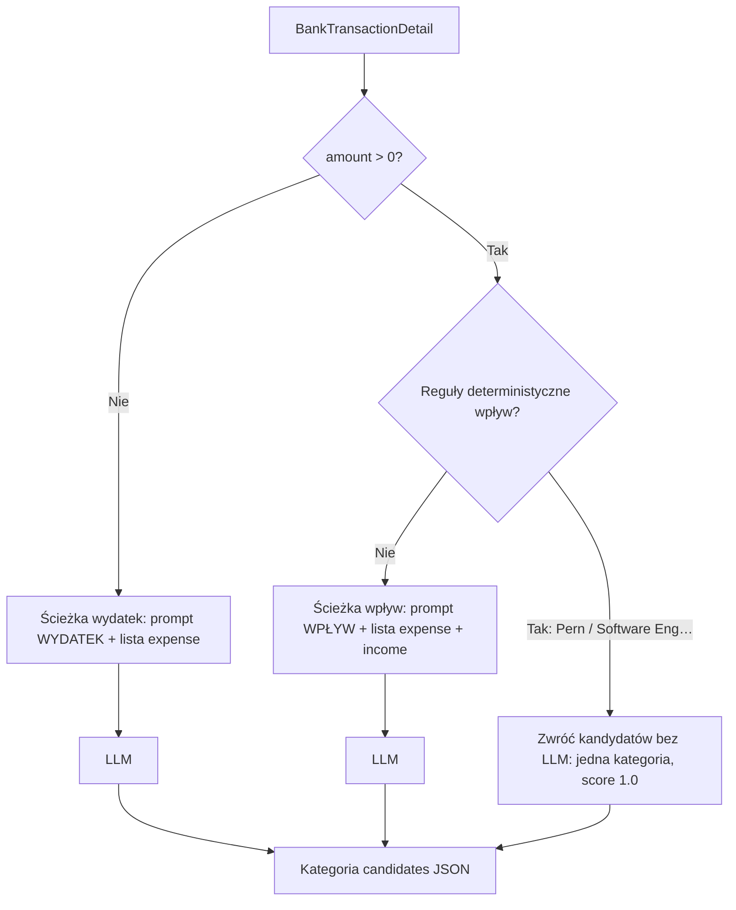

# Kategoryzacja bankowa — routing wpływ/wydatek, reguły pensji, grupa Wynagrodzenie

**Date:** 2026-04-21  
**Status:** Draft (do akceptacji po review pliku)  
**Suggested branch:** `feature/bank-inflow-categorization-routing`

---

## Problem

Wpływy (`amount > 0`) są kategoryzowane przez ten sam LLM i **tę samą listę kategorii** co wydatki: `CategoriesRepository.get_categories()` zwraca wyłącznie `c_type = 'expense'`, więc model **nie widzi** kategorii `income` (m.in. pensji). W efekcie opisy typu „Wypłata” / „WYNAGR …” dostają sensownie tylko **wydatkowe** etykiety („Inne”, „Usługi”).

Użytkownik chce:

1. **Podział deterministyczny przed LLM:** jeśli można rozstrzygnąć regułami — zrobić to **zanim** wywołanie trafi do niedeterministycznego modelu.
2. **Routing po kwocie:** `amount > 0` w 100% oznacza wpływ — ma to wybierać **osobną ścieżkę promptu** (podejście **C** z brainstormingu).
3. **Hierarchia kategorii:** grupa / kategoria nadrzędna **„Wynagrodzenie”** z podkategoriami **„Pensja Ada”** i **„Pensja Paweł”** (istniejące rekordy — do przepięcia pod wspólnego rodzica).
4. **Reguły pensji (kontrahent):**
   - **Ada:** wpływ od kontrahenta związanego z **Pern** (dopasowanie po polu kontrahenta z CSV banku).
   - **Paweł:** wpływ od **Software Engineering Paweł Świerblewski** (tożsamość kontrahenta w wyciągu).

---

## Scope

- **Backend:** `BankCategorizationService` (+ ewentualnie mały moduł stałych/reguł), `CategoriesRepository`, migracja SQL kategorii, testy jednostkowe.
- **Poza scope:** zmiana UI listy bankowej, paragony (`CategoriesService` / OCR) — **bez zmian**; nadal tylko kategorie wydatkowe, o ile nie zdecydujemy inaczej w osobnym zadaniu.
- **Celery / import CSV:** bez zmian kontraktu zadań; po importcie nadal wywoływana jest ta sama ścieżka `assign_candidates` / `assign_candidates_async`.

---

## Ustalenia z researchu

- W bazie **istnieją** `Pensja Ada`, `Pensja Paweł` jako `income`, lecz **nie trafiają** do promptu bankowego z powodu filtra `expense` w `get_categories()`.
- Wpływy mają często **wypełnione `category_candidates`** — ale wyłącznie z ID kategorii **wydatkowych**.

---

## Architektura — przepływ

1. **Wejście:** `BankTransactionDetail` (jak dziś).
2. **Router:** `amount > 0` ⇒ gałąź **wpływ**; w przeciwnym razie ⇒ gałąź **wydatek** (zakładamy, że w danych importu bankowego kwota zerowa nie występuje; jeśli wystąpi — traktować jak wydatek lub „nieobsługiwane” — **do decyzji implementacyjnej:** `<= 0` ⇒ wydatek).
3. **Warstwa deterministyczna (tylko wpływ):** kolejność sprawdzeń **od najwęższej reguły** (dokładniejszy kontrahent), potem ewentualnie ogólniejsze — na start **dwie reguły** pensji (poniżej).
4. **LLM:** wywoływany **tylko** gdy gałąź wpływ **nie** trafiła w regułę deterministyczną, albo gdy gałąź to wydatek.

---

## Reguły deterministyczne — pensje

Wszystkie warunki **dodatkowo** wymagają `amount > 0` (router już to gwarantuje w gałęzi wpływ).

| Kategoria docelowa | Warunek na `counterparty` (propozycja techniczna) |
|--------------------|---------------------------------------------------|
| **Pensja Ada** | Po normalizacji: zawiera **`pern`** jako podciąg; **porównanie zawsze bez rozróżniania wielkości liter** (np. `ILIKE '%pern%'`, `casefold()`, lub `lower()` po obu stronach). *Uwaga:* jeśli w wyciągu pojawią się fałszywe trafienia, zaostrzyć do wzorca z nazwy firmy użytkownika. |
| **Pensja Paweł** | Normalizacja + dopasowanie do pełnej nazwy **`Software Engineering Paweł Świerblewski`** (łącznie z wariantem ASCII bez ogonków); **wielkość liter ignorowana** — `SOFTWARE ENGINEERING`, `paweł`, `swierblewski` itd. muszą pasować tak samo jak wersje „książkowe”. |

**Normalizacja kontrahenta (minimalna, przed porównaniem):**

- `strip`, zamiana wielokrotnych spacji na pojedynczą.
- **Wielkość liter:** wszystkie testy dopasowania dla obu reguł (Pern i Software Engineering…) są **case-insensitive** — obowiązkowo `casefold()` / `lower()` na obu stronach albo `ILIKE` w SQL, bez wyjątków.
- **Polskie znaki:** zamiana na ASCII dla porównania alternatywnego (np. `Ś` → `S`, `ł` → `l`), **oraz** surowy string — reguła uznawana za spełnioną, jeśli pasuje którykolwiek wariant (łatwiejsze dopasowanie do Pekao bez ogonków w eksporcie).

**Priorytet:** jeśli kiedyś dwie reguły mogłyby pasować jednocześnie, **kolejność w kodzie** ustala zwycięzcę; przy obecnych nazwach konflikt jest mało prawdopodobny.

**Wynik:** lista kandydatów jak z LLM, np. jeden element `[{ category_id, category_name, category_score: 1.0 }]` — **bez wywołania API** OpenAI.

---

## Migracja danych — hierarchia „Wynagrodzenie”

1. Dodać kategorię główną **`Wynagrodzenie`**, `c_type = 'income'`, ten sam `category_group` co istniejące pensje (**`Salary Income`**), `parent_id = NULL` (jeśli nie ma jeszcze rekordu o tej nazwie).
2. Ustawić **`parent_id`** dla istniejących wierszy **`Pensja Ada`** i **`Pensja Paweł`** na id kategorii **`Wynagrodzenie`**.
3. **Nie zmieniać** `id` kategorii pensji — żeby nie invalidować historii `bank_transactions.category_id` ani JSON kandydatów.

Skrypt migracji: idempotentny (`INSERT … ON CONFLICT` / `WHERE NOT EXISTS` w zależności od ograniczeń na `categories`).

---

## Repozytorium kategorii

- **`get_categories()`** — **bez zmian** (paragony / kompatybilność wstecz): nadal tylko `expense`.
- **Nowe metody** (nazwy robocze):
  - `get_categories_for_bank_expense_prompt()` — jak obecne `get_categories()` (expense).
  - `get_categories_for_bank_inflow_prompt()` — **expense ∪ income**, ten sam kształt kolumn co dziś (`id`, `name`, `parent_name`) dla tabeli markdown.

`BankCategorizationService.build()` ładuje **dwie** tabele markdown (lub jedną strukturę z dwoma stringami).

---

## Prompty — dwie wersje

### Wspólne

- Model, tool-call, schema `CategoryCandidatesTransaction` — **bez zmian**.
- Kontekst historyczny (`_build_context_section`) — **bez zmian** w pierwszej iteracji (ew. później: dla wpływów preferować historię wpływów — osobny ticket).

### Prompt **WYDATEK** (`amount <= 0`)

- Zachowanie zbliżone do obecnego: ekspert od polskich transakcji, **kategorie z listy (wyłącznie expense)**.
- Lista w szablonie: wynik `get_categories_for_bank_expense_prompt()`.

### Prompt **WPŁYW** (`amount > 0`, po pominięciu reguł deterministycznych)

- Rola: ten sam profil eksperta, ale z jasną instrukcją:
  - **Wpływ** może odpowiadać kategorii **przychodu** (np. pensja, zwrot, zasiłek) **albo** sensownie mapować na kategorię „zwrotu” / „przysługi” / „pożyczki” **bez** sztucznego rozdziału „tylko przychody” w raportach — użytkownik **nie** chce osobnego świata kategorii dla przychodów i wydatków w sensie UX; chodzi o **właściwą etykietę zdarzenia**.
  - **Zakaz:** przypisywanie oczywistemu **wynagrodzeniu z pracy** kategorii typu „Jedzenie”, „Usługi” ogólnie, jeśli w liście jest sensowna kategoria pensji / wynagrodzenia.
  - **Opisy** typu „Wypłata”, „wynagrodzenie”, „wynagr”, numery listy płac — preferuj kategorie pod **„Wynagrodzenie”** (dzieci: Pensja Ada / Paweł) **tylko jeśli są na liście**; jeśli kontrahent nie pasuje do reguł deterministycznych, LLM wybiera **najbliższą** kategorię z listy (np. właściwą pensję lub ogólniejszą `income`).
- Lista w szablonie: `get_categories_for_bank_inflow_prompt()` (**expense + income**).
- W szablonie użytkownika dodać jednoznacznie: **`Kierunek: wpływ na konto (kwota dodatnia).`** (lub równoważnik), żeby model nie mylił znaku.

Implementacja: dwa stałe `SYSTEM_PROMPT_EXPENSE`, `SYSTEM_PROMPT_INFLOW` oraz dwa szablony `USER_PROMPT_TEMPLATE_*` albo jeden szablon z parametrem `direction_label` + `system_prompt` — **bez duplikacji logiki budowania kontekstu**.

---

## Zachowanie produktowe

- **Reguła Pern / Software Engineering…** — **zawsze** deterministyczna, **bez LLM** (oszczędność kosztów i stabilność).
- Pozostałe wpływy — LLM z bogatszą listą kategorii.
- **Ponowna kategoryzacja** (`/bank-transactions/recategorize`): po wdrożeniu użytkownik może nadpisać stare kandydaty dla wpływów; nie wymaga się automatycznej migracji historycznych JSON-ów.

---

## Testy

- **Unit:** router `amount > 0` vs `<= 0` wybiera właściwy prompt / tabelę (mock OpenAI).
- **Unit:** dla zmockowanego `tx` z `counterparty` spełniającym Pern / Software Engineering — **brak** wywołania klienta LLM, zwrócone ID **Pensja Ada** / **Pensja Paweł**.
- **Unit:** normalizacja znaków diakrytycznych (przykłady: `Swierblewski` vs `Świerblewski`).
- **Unit:** ignorowanie wielkości liter — np. `PERN S.A.` vs `pern`, `SOFTWARE ENGINEERING PAWEŁ ŚWIERBLEWSKI` vs zapis mieszany.
- **Migracja:** test integracyjny lub skrypt weryfikujący `parent_id` po migracji (opcjonalnie w repo).

---

## Ryzyka i mitigacje

| Ryzyko | Mitigacja |
|--------|-----------|
| Fałszywe trafienie `PERN` w innym kontrahencie | Zaostrzenie wzorca po pierwszym fałszywym alarmie; ewentualnie lista dozwolonych fragmentów nazwy firmy. |
| Bank obcina nazwę kontrahenta | Reguły oparte na najdłuższym stabilnym prefiksie + testy na realnych wierszach z CSV. |
| Dwie tabele kategorii = większy prompt wpływ | Akceptowalne kosztowo vs jakość; ewentualnie w przyszłości skrócić listę tylko do `income` + podzbioru `expense` pod zwroty — **poza tym spec**. |

---

## Feature branch i PR

- Gałąź sugerowana: `feature/bank-inflow-categorization-routing`.
- Merge po review i quality gates.

---

## Self-review (checklist)

- [x] Router: `amount > 0` ⇒ wpływ + prompt WPŁYW; inaczej wydatek + prompt WYDATEK.
- [x] Deterministyczna pensja przed LLM; dwie reguły kontrahenta jawnie opisane.
- [x] Migracja: „Wynagrodzenie” jako rodzic; bez zmiany `id` pensji.
- [x] Repozytorium: osobne metody pod prompt wpływ vs wydatek; `get_categories()` dla paragonów nietknięte.
- [x] Brak sprzeczności z wcześniejszą diagnozą (`expense`-only w starym `get_categories()`).
- [x] Scope: backend + migracja; paragony poza scope.
