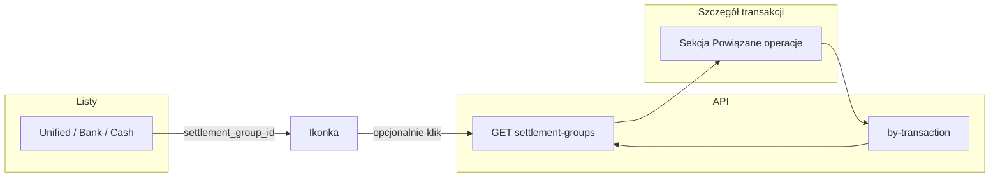

# Zestawy rozliczeniowe (łączenie wydatków i zwrotów) — design

**Nazwa w interfejsie (ustalona): „Powiązane operacje”.**

**Date:** 2026-04-22  
**Status:** Draft (aktualizacja procesów UX, bilans, lista grup — 2026-04-22)  
**Suggested branch:** `feature/transaction-settlement-bundles`

---

## Problem

Użytkownik ma w aplikacji **osobne** zdarzenia pieniężne: wyciąg bankowy, gotówkę, paragony. Obowiązuje model **1:1** między wierszem wydatku a pozycją paragonu (`receipt_bank_links`, `receipt_cash_links`).

Rzeczywistość społeczno-rozliczeniowa jest bogatsza: **jeden wydatek** (np. restauracja) może być pokrywany **wieloma wpływami** (przelew od A, gotówka od B), a **jeden wpływ** może pokrywać **wiele wydatków** (paliwo + jedzenie — jeden przelew od kolegi). Użytkownik chce **jedną, spójną opowieść** widoczną z każdej powiązanej pozycji oraz **wskaznik w tabelach**, że transakcja wchodzi w szersze rozliczenie.

Dane referencyjne (prod): `bank_transactions` 2484 (Burrata, −450), 2481 (wpływ 150, Andrzej), `cash_transactions` 9 (150), paragon z linkiem do 2484 (`receipts_scans` 7828).

---

## Stosunek do istniejących linków

| Mechanizm | Znaczenie | Zmiana w tym feature |
|-----------|-----------|----------------------|
| `receipt_bank_links` / `receipt_cash_links` | „Ten rachunek = ta **konkretna** transakcja bankowa / gotówkowa” | **Bez zmiany semantyki.** Paragony w widoku **powiązanych operacji** pokazujemy **pośrednio** — z członków grupy, którzy mają taki link. |
| Zestaw rozliczeniowy (nowe) | „Te **kilkanaście wierszy** należą do **jednej** sytuacji (np. wspólna kolacja + zwroty)” | Nowa warstwa **nad** poszczególnymi tabelami. |

Paragon **nie** musi być osobnym „członkiem” tabeli grupy, jeśli jest już powiązany z wierszem banku/gotówki w grupie — wystarczy **wyprowadzenie w API/UI**. Opcję dodania niesparowanego skanu do grupy można odłożyć na później (poza v1, patrz Scope).

---

## Poza scope (v1)

- **UI na mobile** — dedykowany layout / QA na wąskich ekranach; v1: **tylko desktop** (patrz sekcja UI / Wymiary).
- **Rozbicie kwot** w obrębie jednego wpływu (alokacja: ile z 300 zł idzie na stację, ile na pizzerię) — opcjonalna **przyszła** warstwa; v1: tylko **powiązania**, bez pól alokacji.
- **Automatyczne sugestie** kandydatów do grupy (heurystyki po dacie / kwocie) — później.
- **Osobny „członek” typu** `receipts_scans` / `receipt_transaction` w tabeli członków — v1: wyłącznie **bank** i **gotówka**; paragony z `JOIN` do istniejących tabel linków.
- Zmiana importu CSV ani deduplikacji `reference_number`.

---

## Słownik i nazewnictwo

### Kod / API (angielski)

- **`settlement_group`** — rekord nadrzędny (zbiór).
- Zasób REST: `settlement-groups` (kebab w URL jak w reszcie API).

### UI (polski) — ustalone

- **Główna nazwa w produkcie: „Powiązane operacje”.** (nagłówki sekcji, lista/ekran gdy wprowadzimy katalog zestawów, spójny branding copy).
- **Krótsze etykiety** (ikona w tabeli, tooltip): np. „W powiązanych operacjach”, **„Jest w zestawie powiązanych operacji”** albo wariant z „tym samym zespołem wierszy” — ostateczna redakcja przy implementacji, ale termin **„operacje”** zostaje (nie „transakcje” w nagłówku, by nie mylić z pojedynczym przelewem).
- **Akcja tworzenia:** np. **„Dodaj do powiązanych operacji”** / **„Utwórz powiązane operacje”** (dokładna forma w planie implementacji).
- *Powiązane transakcje* (potocznie) — OK w rozmowie; w UI trzymamy **„operacje”**.

### Czego unikać w copy

- Angielskie „**split**” jako nagłówek — w eye-budget „split” jest już użyty przy **kategoryzacji** banku (`category splits`); tu opisy typu: **„pokrywa kilka wydatków”**, **„pozostałe wiersze w tym samym zestawie”**.

---

## Wymagania funkcjonalne

1. Użytkownik może **utworzyć zestaw** i dodawać wiersze `bank_transactions` / `cash_transactions` w dowolnej kolejności, w tym: **(a)** zestaw z **pustym** zestawem członków (np. przed wyjazdem — „kontener” na późniejsze wydatki), **(b)** zestaw tworzony od razu z **wielu** wierszy (np. z modala), **(c)** dopisywanie do już utworzonej grupy. **W sensie merytorycznym** „powiązanie” użytkownik widzi, gdy w grupie jest **co najmniej dwa** wpisy; jednocześnie dopuszczalne są **0 lub 1** wpis tymczasowo (WIP albo pusta grupa).
2. **Każdy** taki wiersz może należeć do **co najwyżej jednego** zestawu.
3. Zestaw opcjonalnie ma **tytuł** i **notatkę** (obaj pola tekstowe, nullable).
4. Z widoku **każdej** transakcji należącej do zestawu: sekcja z **listą pozostałych członków** + **zagregowane paragony** wynikające z istniejących `receipt_*_links` członków.
5. Na **liście** transakcji (zunifikowanej / bank / gotówka — tam gdzie dziś pokazywany jest m.in. `has_receipt`) widoczna **ikonka** (lub odpowiednik `Badge`), że wiersz jest w zestawie.
6. Użytkownik może **usunąć** członka z zestawu, **edytować** metadane zestawu, **rozwiazać** cały zestaw (usuwa powiązania, nie kasuje transakcji).
7. **Rozwiązanie zestawu** (likwidacja `settlement_group` i zwolnienie członków): w **v1** głównie **ręcznie** (akcja „Usuń grupę” / potwierdzenie) oraz zasady po **usunięciu członka** (patrz sekcja *Procesy powiązywania* — edge case: grupa 0 członków vs. „skorupa planistyczna”). Wcześniej rozważane auto-kasowanie przy &lt;2 członkach musi współgrać z **pustą grupą utworzoną przed wydatkami** (scenariusz wyjazdu).
8. W widoku **pojedynczej grupy** (oraz w `GET` detalu) użytkownik widzi **bilans** zestawu: suma wydatków, suma wpływów, różnica (netto) — **tylko informacyjnie**, bez semantyki błędu (bez czerwieni / „do zapłacenia”); to orientacja, nie dług księgowy.

---

## Model danych

### Nowe tabele

```sql
-- Zestaw rozliczeniowy
CREATE TABLE settlement_groups (
    id          SERIAL PRIMARY KEY,
    title       TEXT,
    note        TEXT,
    created_at  TIMESTAMPTZ NOT NULL DEFAULT NOW(),
    updated_at  TIMESTAMPTZ
);

-- Członek: dokładnie jeden z bank albo gotówka (XOR)
CREATE TABLE settlement_group_members (
    id                    SERIAL PRIMARY KEY,
    group_id              INTEGER NOT NULL
                              REFERENCES settlement_groups(id) ON DELETE CASCADE,
    bank_transaction_id   INTEGER
                              REFERENCES bank_transactions(id) ON DELETE CASCADE,
    cash_transaction_id     INTEGER
                              REFERENCES cash_transactions(id) ON DELETE CASCADE,
    created_at            TIMESTAMPTZ NOT NULL DEFAULT NOW(),
    CHECK (
        (bank_transaction_id IS NOT NULL AND cash_transaction_id IS NULL)
        OR
        (bank_transaction_id IS NULL AND cash_transaction_id IS NOT NULL)
    )
);

-- Każda transakcja bank / gotówka w co najwyżej jednym zestawie
CREATE UNIQUE INDEX uq_sgm_bank ON settlement_group_members (bank_transaction_id)
    WHERE bank_transaction_id IS NOT NULL;
CREATE UNIQUE INDEX uq_sgm_cash ON settlement_group_members (cash_transaction_id)
    WHERE cash_transaction_id IS NOT NULL;

CREATE INDEX idx_sgm_group ON settlement_group_members (group_id);
```

### Zachowanie przy usuwaniu transakcji (członka / całej grupy)

- `ON DELETE CASCADE` z członka: skasowanie wiersza `bank_transactions` / `cash_transactions` usuwa odpowiedni wiersz w `settlement_group_members` (CASCADE w definicji FK do transakcji), potem w warstwie aplikacji (lub triggerze) **dopasować** regułę do **dopuszczalnych pustych grup** (scenariusz wyjazdu) — prosty trigger „`member_count` &lt; 2 ⇒ usuń grupę” **nie** wystarcza bez rozszerzenia (patrz *Procesy powiązywania*).
- **Nie w specyfikujemy tutaj ostatecznego triggera** — decyzja w planie implementacji, po wyborze jednej z opcji: **(A)** brak auto-kasowania po liczniku; tylko jawne `DELETE` grupy i CASCADE z importu, **(B)** flaga / źródło utworzenia grupy, **(C)** inna spójna reguła opisana w teście integracyjnym.

### Inwarianty (aplikacja + DB)

- Tworzenie / dodawanie: **odrzucenie (409)**, jeśli wybrany `bank_transaction_id` lub `cash_transaction_id` już występuje w `settlement_group_members` (lub w innej grupie).
- `POST` nowej grupy: **`members` może być pustą listą** (grupa tylko z `title?` / `note?`) **albo** zawierać jeden albo wiele wierszy — **walidacja „co najmniej 2** wpisy” dotyczy **zapisu w modalu** „utwórz z bieżącej transakcji + inne” (UX), a nie twardo API, jeśli przewidujemy puste grupy.
- **Zapis z modala** (łączenie bieżącej transakcji z co najmniej jedną inną): **przed utworzeniem** zbioru musi być **≥2 łączne** wybrane wiersze (bieżący + zaznaczone w wyszukiwaniu) — w przeciwnym razie brak `POST` (komunikat po polsku).

---

## API (szkic kontraktu)

Wszystkie odpowiedzi JSON; błędy zgodne z `backend/AGENTS.md` / istniejącym `ApiError` (4xx z ciałem błędu).

| Metoda | Ścieżka | Opis |
|--------|---------|------|
| `POST` | `/settlement-groups` | Ciało: `title?`, `note?`, `members: [{ "source_type": "bank" \| "cash", "id": int }, ...]` — `members` **może być `[]`** (pusta grupa). Gdy `members` niepuste: unikalne pary, brak konfliktu. Zwraca `SettlementGroupDetail`. |
| `GET` | `/settlement-groups` | **Lista grup** (paginacja + sort jak w innych listach) z parametrem **`search`** (opcjonalnie) po `title`, `note`, ewentualnie zdenormalizowanym podsumowaniu; **używany w pickerze** „dołącz do istniejącej grupy” (scen. 3 i 4). Zwraca wiersze `SettlementGroupListItem` (min.: `id`, `title`, `created_at`, `member_count`, opcjonalnie skrót bilansu). |
| `GET` | `/settlement-groups/{id}` | Pełny zestaw: członkowie + `linked_receipts` + **bilans** (patrz *SettlementGroupDetail*). |
| `GET` | `/settlement-groups/by-transaction?source_type=bank&transaction_id=…` (lub `cash`) | 404 jeśli brak; inaczej jak `GET /settlement-groups/{id}`. |
| `PATCH` | `/settlement-groups/{id}` | Tylko `title`, `note`. |
| `POST` | `/settlement-groups/{id}/members` | Pojedynczy członek; 409 gdy transakcja już w innej grupie. Po dodaniu przeliczyć spójność. |
| `DELETE` | `/settlement-groups/{id}/members` | Ciało lub query: `source_type` + `transaction_id` — wyciąga członka; reakcja, gdy zostaje 0 / 1 członek — **zgodna z ustaloną w planie** regułą (patrz inwarianty pustych grup; nie wymuszać tutaj twardo sprzecznej z pustym „kontenerem” wyjazdu). |
| `DELETE` | `/settlement-groups/{id}` | Usuwa grupę (CASCADE na członków); transakcje zostają. |

**`SettlementGroupDetail` (Pydantic, szkic):**

- `id`, `title`, `note`, `created_at`, `updated_at`
- `member_count: int` — liczba członków (dla pustych grup `0`).
- `members: list[SettlementMember]` — każdy z: `source_type`, `id`, dane do podglądu (data, kwota, opis, `vendor_name` — jak w listach) — odczyt z repozytoriów bank/cash, spójnie ze znakiem `amount` jak w `UnifiedTransaction`.
- `linked_receipts: list[LinkedReceiptSummary]` — dla każdego `bank` / `cash` w grupie, który ma `receipt_*_links` (deduplikacja po `receipts_scans.id`).
- **Bilans (liczone na backendzie, ta sama logika znaku co lista zunifikowana):**  
  - `total_expense: Decimal` (suma wydatków, np. ujemne `amount` w konwencji wyciągu — **dokładne mapowanie w implementacji** albo `abs` dla jawnej sumy wydanej)  
  - `total_income: Decimal` (suma wpływów)  
  - `net: Decimal` (różnica)  
  W UI: **neutralna prezentacja** (np. mniejszy tekst, bez koloru „błąd/alert”); służy do orientacji przy częściowych zwrotach (np. 150 z 286,34 zł).

Listy `GET` transakcji (unified, bank, cash) otrzymują **dodatkowe pole** schematycznie:

- `settlement_group_id: int | null` **lub** `in_settlement_group: bool` — wystarczy `bool` w listach, jeśli chcemy ograniczyć rozmiar; `id` potrzebny, jeśli z ikony mamy iść w „szczegóły grupy” jednym klikem **bez** dodatkowego GET po transakcji. **Rekomendacja:** `settlement_group_id: int | null` w modelach listowych (jeden `LEFT JOIN` / podzapytanie z `settlement_group_members`).

---

## Repozytoria

- `SettlementGroupsRepository` (nowy): CRUD + `get_by_id`, `get_list(search, limit, offset)`, `get_id_for_member(source_type, id)`, `add_members`, `remove_member`, `delete_group`, agregaty pod **bilans** (sumy po `amount` z bank/cash z poprawnym znakiem).
- Rozszerzenie zapytań w `UnifiedTransactionsRepository` oraz listach `BankTransactions` / `CashTransactions` o **jedną** kolumnę `settlement_group_id` (LEFT JOIN na `settlement_group_members`).

---

## Procesy powiązywania (UX)

Poniżej ustalenia z brainstorningu — **v1 desktop**, spójne z sekcją „Powiązane operacje”.

### Scenariusz 1 — od wydatku: nowa grupa z wyszukiwaniem

1. Użytkownik jest w **szczególe transakcji bankowej** (np. Burrata). W sekcji **„Powiązane operacje”** klika akcję tworzenia (np. **„Dodaj…“**).
2. Otwiera się **modal** z listą **pełnego zunifikowanego zestawienia** (ten sam charakter co główna lista transakcji: kolumny, sort, **wyszukiwanie tekstowe** po opisie / kontrahencie itd. — wzorzec z istniejącego ekranu unified).
3. Wiersz **bieżącej** transakcji jest traktowany jako **„kotwica”**: pozostaje **na górze** (osobna strefa „Z wybranej transakcji” / **przypięte**), żeby **nie znikał** przy zmianie frazy w wyszukiwarce.
4. W polu wyszukiwania użytkownik wpisuje np. **„Andrzej”** — na liście wyników zaznacza **checkbox** przy wpływie; zaznaczony wiersz ląduje w strefie przypiętych (jak punkt 3).
5. Czyści / zmienia wyszukiwanie (np. **„Topchips”**), zaznacza **gotówkę** — kolejna przypięta pozycja.
6. Opcjonalnie wypełnia **nazwę grupy** (pole w modalu; mapuje na `title`).
7. **Zapisz** — jeden `POST /settlement-groups` z listą `members` odpowiadających przypiętym wierszom (łącznie z bieżącą) **lub** sekwencja `POST` grupy + `POST` members — **decyzja implementacyjna**, by zachować spójność transakcji DB; semantyka: **po zapisie** wszystkie wskazane operacje należą do jednej grupy.

**Modal — minimum UX:** strefa **Przypięte** (bieżąca + zaznaczone), strefa **Wyniki wyszukiwania**; przycisk **Usuń z przypiętych** na każdym przypiętym (oprócz bieżącej, jeśli ma sens tylko jako kotwica — do drobnostki w planie).

### Scenariusz 2 — późniejszy wpływ / nowa transakcja w istniejącej grupie

- Wejście z **dowolnej** transakcji już w grupie (np. późniejszy wpływ od kolegi).
- Ten sam **modal wyszukiwania** (pkt 1–5), z tą różnicą, że **domyślny tryb** to **„Dodaj do bieżącej grupy”** (pre-wybrany `group_id` z kontekstu) **albo** wybór **„Utwórz nową grupę”** (jak scen. 1). Oba warianty **nie psują** opisu: jedna ścieżka `POST .../members` do istniejącej grupy, druga `POST` nowej grupy z wieloma członkami.

### Scenariusz 3 — nowa transakcja, **dołączenie do istniejącej** grupy (bez wyszukiwania wszystkich transakcji)

- Użytkownik wchodzi w transakcję **jeszcze niewpiętą**; w sekcji **„Powiązane operacje”** wybiera wariant **„Dołącz do istniejącej grupy”** (język do dopracowania w copy, sens jednoznaczny).
- Otwiera się **picker grup**: to **ten sam** zasób co **`GET /settlement-groups?search=...`** — czyli **widok listy wszystkich grup** (kolumny: tytuł, data utworzenia, liczba członków, ewentualnie skrót bilansu) z **polem wyszukiwania** po tytule / notatce.
- Po wyborze grupy: **`POST /settlement-groups/{id}/members`** z bieżącym `source_type` + `id`.
- Zgadza się to z tym, co wcześniej było opisane jako *„nice-to-have* `/settlement-groups`”: **lista + search jest potrzebna do tego pickera** — w spec podnosimy ją do **MVP (v1)**. Pełna strona nawigacyjna **„Wszystkie powiązane operacje”** może być tym samym komponentem co picker (osobna trasa) lub tylko ekran detalu grupy z linkami — **w planie** jeden spójny widok `GET /settlement-groups`.

### Scenariusz 4 — grupa przed transakcjami (wyjazd w góry)

- Użytkownik może **najpierw** utworzyć **pustą** grupę (tytuł np. **„Bieszczady 2026”**) z ekranu **`/settlement-groups`** (przycisk **„Nowa grupa”** → `POST` z `members: []`) **lub** z miejsca wyszczególnionego w nawigacji.
- Później dodaje wydatki / wpływy: z list transakcji (akcja „Dodaj do powiązanych operacji” → wybór tej grupy) albo z modala w szczególe.
- Wymusza to **API i reguły** dopuszczające **0 członków** — patrz inwarianty; **nawigacja** do listy grup w **v1** jest **obowiązkowa** (nie tylko nice-to-have).

### Scenariusz 5 — bilans w grupie

- Na **karcie / stronie** grupy (`GET /settlement-groups/{id}`) oraz w miejscu, gdzie pokazujemy skrót (lista grup): **suma wydatków**, **suma wpływów**, **netto** — neutralnie (bez czerwonego wyróżnienia „długu”); służy do szybkiej orientacji (np. częściowy zwrot 150 zł wobec 286,34 zł jest **OK**).

### Warianty techniczne (część „skomplikowana”) — odniesienie

| Temat | Opcje (skrót) |
|-------|----------------|
| Pusta grupa vs. auto-kasowanie po usunięciu członka | **(A)** brak auto-kasowania po liczniku, **(B)** kolumna statusu, **(C)** inna reguła — **wybór w planie** z testami, bez sprzeczności z pustym kontenerem wyjazdu. |
| Zapis w modalu (jeden POST vs. wiele) | Jeden `POST` z pełną listą `members` vs. `POST` grupy + pętla `members` — wydajność i transakcja DB. |

---

## UI

### Wymiary

- **v1: tylko desktop** — świadome projektowanie i weryfikacja na **szerokich** widokach. **Ekran mobilny / wąskie kolumny — poza scope** tej wersji (osobna iteracja, gdy będzie potrzeba).

### Listy (zunifikowana / bank / gotówka)

- Kolumna lub komórka z **ikoną** (np. `Link2` / `Users` — `Split` w nazwie/ikonie **unikamy** z powodu `category splits`) + `aria-label` po polsku, np. **„W powiązanych operacjach”**.
- Tooltip: **„Jest w zestawie powiązanych operacji”** (krótko). Opcjonalnie klik przechodzi do `GET` grupy (panel boczny / podstrona).

### Widok transakcji (detail)

- Sekcja **„Powiązane operacje”**:
  - **Brak grupy** — co najmniej dwie intencje: **(i)** **„Utwórz / dodaj wyszukiwaniem”** → modal jak w *Procesach* (zunifikowana lista + przypięcia + opcjonalna nazwa), **(ii)** **„Dołącz do istniejącej grupy”** → picker `GET /settlement-groups?search=`.
  - **Jest w grupie** — lista pozostałych członków, **bilans** (skrót lub pełne wartości z `SettlementGroupDetail`), paragony z `linked_receipts`, akcje: **Dodaj kolejny** (ten sam modal / dołącz do tej grupy), **Rozłącz**, edycja metadanych grupy (jeśli przewidziane z tego ekranu).
- Szczegóły modala: sekcja *Procesy powiązywania* (nie duplikować w implementation plan bez odesłania do tego miejsca).

### Widok **listy** `/settlement-groups` (v1)

- **MVP:** dedykowana strona (desktop) z listą grup, wyszukiwaniem, **„Nowa pusta grupa”**, wejściem w **detal** grupy (`/settlement-groups/{id}`) z pełnym **bilansem** i członkami.
- Ten sam listowy endpoint obsługuje **picker** w trybie „dołącz do istniejącej” (scen. 3) — spójny komponent tabeli / listy, opcjonalnie wariant „compact” w modalu.

---

## Testy

- Testy **repozytorium** (transakcja DB lub integracja z testową PG): unikalność, **pusta grupa** + dodanie członków, **409** przy duplikacie członka, **bilans** (suma znaków) dla mieszanki wydatki + wpływy.
- Reguła **automatycznego kasowania** po liczbie członków — testy zgodne z **wybraną w planie** opcją (A/B/C), bez sprzeczności z pustym kontenerem.
- Testy **API** (wzorzec `app` tests): `POST` pustej, `GET` listy + `search`, `POST` members, `GET` by id z polami bilansu, ścieżka usuwania.
- **Zero** regresji: `receipt_*_links` w SELECT list.

---

## Bezpieczeństwo i wielodostęp (jeśli kiedyś)

Dziś prawdopodobnie single-user. Gdy pojawią się org / role: ograniczenie `settlement_groups` do kontekstu użytkownika (jeśli tabela będzie miała `user_id`); **poza scope** v1.

---

## Migracja

- Jeden plik Yoyo w `backend/migrations/`: `20260422_01_settlement_groups.sql` (lub następny wolny numer) z tabelami i indeksami.
- Brak danych startowych; brak backfillu.

---

## Mermaid — przepłyg danych w UI



---

## Checklist przed implementacją

- [x] Nazwa w UI: **„Powiązane operacje”** (akceptacja 2026-04-22).
- [x] **Lista `/settlement-groups` + wyszukiwanie** w **v1** (picker + pusta grupa + wyjazd) — zapisane w *Procesach* i *UI*.
- [ ] Ostateczna reguła **usunięcia / triggera** przy 0/1 członku (wariant A/B/C z tabeli w *Procesach*).
- [ ] Jedna decyzja: **pojedynczy `POST` z pełnymi `members`** vs. wieloetapowe dodawanie w modalu.

---

## Self-review (2026-04-22, aktualizacje: nazwa, desktop, proces, bilans)

- **Nazwa UI** — **Powiązane operacje**; sekcja *Procesy powiązywania* opisuje przepływy 1–5.
- **Puste grupy, lista grup, bilans, modal z unified** — w spec; **otwarta decyzja** tylko co do triggera &lt;2 członków (tabela wariantów) i kształtu POST z modala.
- **Spójność:** `receipt_*_links` nienaruszone; konflikt wcześniejszej rekomendacji triggera usunięty — zastąpiona wariantami w *Model danych* / *Procesy*.
- **Scope v1:** szersze niż pierwotny szkic (strona listy grup obowiązkowo); dalej bez alokacji kwot w obrębie jednego wpływu.
- **Bilans:** wymagania neutralnego UI bez „alertu czerwonego” — w *Wymaganiach* i *SettlementGroupDetail*.
