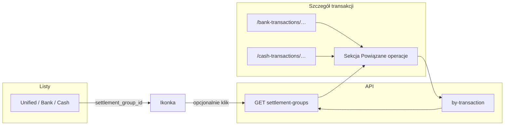

# Zestawy rozliczeniowe (łączenie wydatków i zwrotów) — design

**Nazwa w interfejsie (ustalona): „Powiązane operacje”.**

**Date:** 2026-04-22  
**Status:** Approved  
**Suggested branch:** `feature/transaction-settlement-bundles`

---

## Problem

Użytkownik ma w aplikacji **osobne** zdarzenia pieniężne: wyciąg bankowy, gotówkę, paragony. Obowiązuje model **1:1** między wierszem wydatku a pozycją paragonu (`receipt_bank_links`, `receipt_cash_links`).

Rzeczywistość społeczno-rozliczeniowa jest bogatsza: **jeden wydatek** (np. restauracja) może być pokrywany **wieloma wpływami** (przelew od A, gotówka od B), a **jeden wpływ** może pokrywać **wiele wydatków** (paliwo + jedzenie — jeden przelew od kolegi). Użytkownik chce **jedną, spójną opowieść** widoczną z każdej powiązanej pozycji oraz **wskaznik w tabelach**, że transakcja wchodzi w szersze rozliczenie.

Dane referencyjne (prod): `bank_transactions` 2484 (Burrata, −450), 2481 (wpływ 150, Andrzej), `cash_transactions` 9 (150), paragon z linkiem do 2484 (`receipts_scans` 7828).

---

## Scenariusze życiowe (referencyjne)

Poniżej **spójne historie** z rozmów — nie są to wymagania testowe, tylko **obraz całości** produktu: po co grupy, jakie przypadki mają działać intuicyjnie.

### A. Restauracja, paragon, kilka zwrotów (Burrata)

- Płacisz kartą w **Burrata** — na wyciągu jest **jeden wydatek bankowy**; do tego samego wiersza masz już **powiązany paragon** (jak dziś przez `receipt_bank_links`).
- Później **Andrzej** robi Ci **przelew 150 zł** (osobny wpływ na koncie).
- Ktoś inny oddaje **150 zł gotówką** (np. „Topchips” — osobny wpis `cash_transactions`).
- Chcesz **jednej grupy „Powiązane operacje”**, w której widać: wydatek + oba zwroty + **paragon** (wyciągnięty z linku do wydatku), bez dublowania paragonu jako osobnego „członka” w bazie.

### B. Jeden przelew za dwie różne rzeczy (paliwo + jedzenie)

- Masz **osobny wydatek** na stacji i **osobny** w restauracji (dwa paragony, dwie operacje bankowe).
- Kolega **jednym przelewem** oddaje Ci pieniądze **za część obu** (np. „za paliwo z trasy i za moją pizzę”).
- W grupie mają się znaleźć **oba wydatki** i **ten jeden wpływ** — bilans może być tylko **w przybliżeniu** „równe połówce” intencji; nie oczekujesz w systemie **alokacji kwot** między stacją a restauracją (to poza v1), tylko **czytelnego powiązania** opowieści.

### C. Zwrot dopiero po czasie

- Grupa już istnieje (np. scen. A). **Kilka dni później** pojawia się na koncie przelew od znajomego.
- Wchodzisz w **tę nową transakcję** (albo w dowolną z grupy) i **dopinasz** ją do **tej samej** grupy — ten sam modal wyszukiwania / ta sama grupa z kontekstu (patrz *Procesy powiązywania*).

### D. Wyjazd w góry — grupa zanim pojawią się wydatki

- Szykuje się **wielodniowy wyjazd** ze znajomymi; rozliczenia będą **co kilka dni** albo **na koniec**, gdy zbiorzysz wszystkie koszty.
- **Najpierw** tworzysz **pustą grupę** (np. tytuł „Bieszczady 2026”), **bez** jeszcze żadnej transakcji w środku.
- W trakcie i po wyjeździe **dokładasz** wydatki i wpływy do tej grupy — jeden wspólny „worek” rozliczeniowy.

### E. Bilans orientacyjny (częściowy zwrot)

- W grupie jest np. wydatek **286,34 zł** i wpływ **150 zł** — wiesz, że to **„w założeniu połowa”**, a nie błąd w danych.
- W UI pokazujesz **sumę wydatków, sumę wpływów, różnicę** jako **informację neutralną** (bez czerwonego alarmu), żeby szybko zobaczyć, czy jesteście w okolicy rozliczenia — **nie** jako windykację ani status długu.

### F. Dołączenie samotnej operacji do istniejącej grupy (picker)

- Pojawia się **nowa** transakcja (np. świeży wpływ); chcesz ją **wpiąć w już utworzoną grupę** bez przeszukiwania całej historii jak przy tworzeniu od zera.
- Z poziomu szczegółu wybierasz **listę istniejących grup** (wyszukiwanie po tytule) i **dołączasz** — to ten sam widok danych co strona `/settlement-groups` / `GET` z parametrem `search`.

---

## Stosunek do istniejących linków

| Mechanizm | Znaczenie | Zmiana w tym feature |
|-----------|-----------|----------------------|
| `receipt_bank_links` / `receipt_cash_links` | „Ten rachunek = ta **konkretna** transakcja bankowa / gotówkowa” | **Bez zmiany semantyki.** Paragony w widoku **powiązanych operacji** pokazujemy **pośrednio** — z członków grupy, którzy mają taki link. |
| Zestaw rozliczeniowy (nowe) | „Te **kilkanaście wierszy** należą do **jednej** sytuacji (np. wspólna kolacja + zwroty)” | Nowa warstwa **nad** poszczególnymi tabelami. |

Paragon **nie** musi być osobnym „członkiem” tabeli grupy, jeśli jest już powiązany z wierszem banku/gotówki w grupie — wystarczy **wyprowadzenie w API/UI**. Opcję dodania niesparowanego skanu do grupy można odłożyć na później (poza v1, patrz Scope).

---

## Poza scope (v1)

- **UI na mobile** — dedykowany layout / QA na wąskich ekranach; v1: **tylko desktop** (patrz sekcja UI / Wymiary).
- **Rozbicie kwot** w obrębie jednego wpływu (alokacja: ile z 300 zł idzie na stację, ile na pizzerię) — opcjonalna **przyszła** warstwa; v1: tylko **powiązania**, bez pól alokacji.
- **Automatyczne sugestie** kandydatów do grupy (heurystyki po dacie / kwocie) — później.
- **Osobny „członek” typu** `receipts_scans` / `receipt_transaction` w tabeli członków — v1: wyłącznie **bank** i **gotówka**; paragony z `JOIN` do istniejących tabel linków.
- Zmiana importu CSV ani deduplikacji `reference_number`.

---

## Słownik i nazewnictwo

### Kod / API (angielski)

- **`settlement_group`** — rekord nadrzędny (zbiór).
- Zasób REST: `settlement-groups` (kebab w URL jak w reszcie API).

### UI (polski) — ustalone

- **Główna nazwa w produkcie: „Powiązane operacje”.** (nagłówki sekcji, lista/ekran gdy wprowadzimy katalog zestawów, spójny branding copy).
- **Krótsze etykiety** (ikona w tabeli, tooltip): np. „W powiązanych operacjach”, **„Jest w zestawie powiązanych operacji”** albo wariant z „tym samym zespołem wierszy” — ostateczna redakcja przy implementacji, ale termin **„operacje”** zostaje (nie „transakcje” w nagłówku, by nie mylić z pojedynczym przelewem).
- **Akcja tworzenia:** np. **„Dodaj do powiązanych operacji”** / **„Utwórz powiązane operacje”** (dokładna forma w planie implementacji).
- *Powiązane transakcje* (potocznie) — OK w rozmowie; w UI trzymamy **„operacje”**.

### Czego unikać w copy

- Angielskie „**split**” jako nagłówek — w eye-budget „split” jest już użyty przy **kategoryzacji** banku (`category splits`); tu opisy typu: **„pokrywa kilka wydatków”**, **„pozostałe wiersze w tym samym zestawie”**.

---

## Wymagania funkcjonalne

1. Użytkownik może **utworzyć zestaw** i dodawać wiersze `bank_transactions` / `cash_transactions` w dowolnej kolejności, w tym: **(a)** zestaw z **pustym** zestawem członków (np. przed wyjazdem — „kontener” na późniejsze wydatki), **(b)** zestaw tworzony od razu z **wielu** wierszy (np. z modala), **(c)** dopisywanie do już utworzonej grupy. **W sensie merytorycznym** „powiązanie” użytkownik widzi, gdy w grupie jest **co najmniej dwa** wpisy; jednocześnie dopuszczalne są **0 lub 1** wpis tymczasowo (WIP albo pusta grupa).
2. **Każdy** taki wiersz może należeć do **co najwyżej jednego** zestawu.
3. Zestaw opcjonalnie ma **tytuł** i **notatkę** (obaj pola tekstowe, nullable).
4. Z widoku **każdej** transakcji należącej do zestawu: sekcja z **listą pozostałych członków** + **zagregowane paragony** wynikające z istniejących `receipt_*_links` członków.
5. Na **liście** transakcji (zunifikowanej / bank / gotówka — tam gdzie dziś pokazywany jest m.in. `has_receipt`) widoczna **ikonka** (lub odpowiednik `Badge`), że wiersz jest w zestawie.
6. Użytkownik może **usunąć** członka z zestawu, **edytować** metadane zestawu, **rozwiazać** cały zestaw (usuwa powiązania, nie kasuje transakcji).
7. **Rozwiązanie zestawu** (likwidacja `settlement_group`): **wariant (A)** — grupę usuwa wyłącznie **użytkownik** (akcja „Usuń grupę” / jawny `DELETE /settlement-groups/{id}`). **Brak** automatycznego kasowania grupy po samej liczbie członków (żadnego triggera „&lt;2 ⇒ usuń”). Usunięcie ostatniego członka (`DELETE .../members`) **zostawia** pustą grupę w bazie, dopóki użytkownik jej nie skasuje — ułatwia to **lista grup** z widoczną liczbą członków i **odróżnieniem** `member_count = 0` (patrz *Widok listy*).
8. W widoku **pojedynczej grupy** (oraz w `GET` detalu) użytkownik widzi **bilans** zestawu: suma wydatków, suma wpływów, różnica (netto) — **tylko informacyjnie**, bez semantyki błędu (bez czerwieni / „do zapłacenia”); to orientacja, nie dług księgowy.

---

## Model danych

### Nowe tabele

```sql
-- Zestaw rozliczeniowy
CREATE TABLE settlement_groups (
    id          SERIAL PRIMARY KEY,
    title       TEXT,
    note        TEXT,
    created_at  TIMESTAMPTZ NOT NULL DEFAULT NOW(),
    updated_at  TIMESTAMPTZ
);

-- Członek: dokładnie jeden z bank albo gotówka (XOR)
CREATE TABLE settlement_group_members (
    id                    SERIAL PRIMARY KEY,
    group_id              INTEGER NOT NULL
                              REFERENCES settlement_groups(id) ON DELETE CASCADE,
    bank_transaction_id   INTEGER
                              REFERENCES bank_transactions(id) ON DELETE CASCADE,
    cash_transaction_id     INTEGER
                              REFERENCES cash_transactions(id) ON DELETE CASCADE,
    created_at            TIMESTAMPTZ NOT NULL DEFAULT NOW(),
    CHECK (
        (bank_transaction_id IS NOT NULL AND cash_transaction_id IS NULL)
        OR
        (bank_transaction_id IS NULL AND cash_transaction_id IS NOT NULL)
    )
);

-- Każda transakcja bank / gotówka w co najwyżej jednym zestawie
CREATE UNIQUE INDEX uq_sgm_bank ON settlement_group_members (bank_transaction_id)
    WHERE bank_transaction_id IS NOT NULL;
CREATE UNIQUE INDEX uq_sgm_cash ON settlement_group_members (cash_transaction_id)
    WHERE cash_transaction_id IS NOT NULL;

CREATE INDEX idx_sgm_group ON settlement_group_members (group_id);
```

### Zachowanie przy usuwaniu transakcji (członka / całej grupy)

- **Ustalenie — wariant (A, 2026-04-22):** `settlement_groups` **nigdy** nie jest usuwany automatycznie z powodu liczby członków. **Żadnego** triggera SQL / joba w stylu `member_count &lt; 2 ⇒ DELETE settlement_groups`.
- `ON DELETE CASCADE` na `settlement_group_members` względem `bank_transactions` / `cash_transactions`: skasowanie wiersza transakcji usuwa **tylko** wiersz członkostwa; **nadrzędna grupa** zostaje (także gdy w efekcie `member_count` spada do 0) — puste grupy ewentualnie czyścisz ręcznie z listy.
- Usunięcie całej grupy: tylko jawne `DELETE /settlement-groups/{id}` (UI lub API). Transakcje bank/cash **nie** są usuwane.

### Inwarianty (aplikacja + DB)

- Tworzenie / dodawanie: **odrzucenie (409)**, jeśli wybrany `bank_transaction_id` lub `cash_transaction_id` już występuje w `settlement_group_members` (lub w innej grupie).
- `DELETE` członka: **nigdy** w konsekwencji nie usuwa automatem rekordu `settlement_groups` (wariant A).
- `POST` nowej grupy: **`members` może być pustą listą** (grupa tylko z `title?` / `note?`) **albo** zawierać jeden albo wiele wierszy — **walidacja „co najmniej 2** wpisy” dotyczy **zapisu w modalu** „utwórz z bieżącej transakcji + inne” (UX), a nie twardo API, jeśli przewidujemy puste grupy.
- **Zapis z modala** (łączenie bieżącej transakcji z co najmniej jedną inną): **przed utworzeniem** zbioru musi być **≥2 łączne** wybrane wiersze (bieżący + zaznaczone w wyszukiwaniu) — w przeciwnym razie brak `POST` (komunikat po polsku).

---

## API (szkic kontraktu)

Wszystkie odpowiedzi JSON; błędy zgodne z `backend/AGENTS.md` / istniejącym `ApiError` (4xx z ciałem błędu).

| Metoda | Ścieżka | Opis |
|--------|---------|------|
| `POST` | `/settlement-groups` | Ciało: `title?`, `note?`, `members: [{ "source_type": "bank" \| "cash", "id": int }, ...]` — `members` **może być `[]`** (pusta grupa). Gdy `members` niepuste: unikalne pary, brak konfliktu. Zwraca `SettlementGroupDetail`. |
| `GET` | `/settlement-groups` | **Lista grup** (paginacja + sort jak w innych listach) z parametrem **`search`** (opcjonalnie) po `title`, `note`, ewentualnie zdenormalizowanym podsumowaniu; **używany w pickerze** „dołącz do istniejącej grupy” (scen. 3 i 4). Zwraca wiersze `SettlementGroupListItem` (min.: `id`, `title`, `created_at`, **`member_count`** — pod **badge** na liście / w pickerze; styl badge dla `0` vs `>=1` w *Widoku listy*), opcjonalnie skrót bilansu. |
| `GET` | `/settlement-groups/{id}` | Pełny zestaw: członkowie + `linked_receipts` + **bilans** (patrz *SettlementGroupDetail*). |
| `GET` | `/settlement-groups/by-transaction?source_type=bank&transaction_id=…` (lub `cash`) | 404 jeśli brak; inaczej jak `GET /settlement-groups/{id}`. |
| `PATCH` | `/settlement-groups/{id}` | Tylko `title`, `note`. |
| `POST` | `/settlement-groups/{id}/members` | Pojedynczy członek; 409 gdy transakcja już w innej grupie. Po dodaniu przeliczyć spójność. |
| `DELETE` | `/settlement-groups/{id}/members` | Ciało lub query: `source_type` + `transaction_id` — usuwa tylko wiersz członkostwa. Grupa nadrzędna **zostaje** (nawet przy `member_count` 0 po tej operacji) — wariant **(A)**. |
| `DELETE` | `/settlement-groups/{id}` | Usuwa grupę (CASCADE na członków); transakcje zostają. |

**`SettlementGroupDetail` (Pydantic, szkic):**

- `id`, `title`, `note`, `created_at`, `updated_at`
- `member_count: int` — liczba członków (dla pustych grup `0`).
- `members: list[SettlementMember]` — każdy z: `source_type`, `id`, dane do podglądu (data, kwota, opis, `vendor_name` — jak w listach) — odczyt z repozytoriów bank/cash, spójnie ze znakiem `amount` jak w `UnifiedTransaction`.
- `linked_receipts: list[LinkedReceiptSummary]` — dla każdego `bank` / `cash` w grupie, który ma `receipt_*_links` (deduplikacja po `receipts_scans.id`).
- **Bilans (liczone na backendzie, ta sama logika znaku co lista zunifikowana):**  
  - `total_expense: Decimal` (suma wydatków, np. ujemne `amount` w konwencji wyciągu — **dokładne mapowanie w implementacji** albo `abs` dla jawnej sumy wydanej)  
  - `total_income: Decimal` (suma wpływów)  
  - `net: Decimal` (różnica)  
  W UI: **neutralna prezentacja** (np. mniejszy tekst, bez koloru „błąd/alert”); służy do orientacji przy częściowych zwrotach (np. 150 z 286,34 zł).

Listy `GET` transakcji (unified, bank, cash) otrzymują **dodatkowe pole** schematycznie:

- `settlement_group_id: int | null` **lub** `in_settlement_group: bool` — wystarczy `bool` w listach, jeśli chcemy ograniczyć rozmiar; `id` potrzebny, jeśli z ikony mamy iść w „szczegóły grupy” jednym klikem **bez** dodatkowego GET po transakcji. **Rekomendacja:** `settlement_group_id: int | null` w modelach listowych (jeden `LEFT JOIN` / podzapytanie z `settlement_group_members`).

---

## Repozytoria

- `SettlementGroupsRepository` (nowy): CRUD + `get_by_id`, `get_list(search, limit, offset)`, `get_id_for_member(source_type, id)`, `add_members`, `remove_member`, `delete_group`, agregaty pod **bilans** (sumy po `amount` z bank/cash z poprawnym znakiem).
- Rozszerzenie zapytań w `UnifiedTransactionsRepository` oraz listach `BankTransactions` / `CashTransactions` o **jedną** kolumnę `settlement_group_id` (LEFT JOIN na `settlement_group_members`).

---

## Procesy powiązywania (UX)

Poniżej ustalenia z brainstorningu — **v1 desktop**, spójne z sekcją „Powiązane operacje”.

### Scenariusz 1 — od wydatku: nowa grupa z wyszukiwaniem

1. Użytkownik jest w **szczególe transakcji bankowej** (np. Burrata). W sekcji **„Powiązane operacje”** klika akcję tworzenia (np. **„Dodaj…“**).
2. Otwiera się **modal** z listą **pełnego zunifikowanego zestawienia** (ten sam charakter co główna lista transakcji: kolumny, sort, **wyszukiwanie tekstowe** po opisie / kontrahencie itd. — wzorzec z istniejącego ekranu unified).
3. Wiersz **bieżącej** transakcji jest traktowany jako **„kotwica”**: pozostaje **na górze** (osobna strefa „Z wybranej transakcji” / **przypięte**), żeby **nie znikał** przy zmianie frazy w wyszukiwarce.
4. W polu wyszukiwania użytkownik wpisuje np. **„Andrzej”** — na liście wyników zaznacza **checkbox** przy wpływie; zaznaczony wiersz ląduje w strefie przypiętych (jak punkt 3).
5. Czyści / zmienia wyszukiwanie (np. **„Topchips”**), zaznacza **gotówkę** — kolejna przypięta pozycja.
6. Opcjonalnie wypełnia **nazwę grupy** (pole w modalu; mapuje na `title`).
7. **Zapisz** — **jeden** `POST /settlement-groups` z pełną listą `members` odpowiadającą przypiętym wierszom (łącznie z bieżącą), w jednej transakcji DB po stronie backendu. **Ustalenie (2026-04-22):** brak wieloetapowego tworzenia z modala — liczba członków w praktyce **&lt; 5**, więc pojedynczy request jest prostszy i wystarczający.

**Modal — minimum UX:** strefa **Przypięte** (bieżąca + zaznaczone), strefa **Wyniki wyszukiwania**; przycisk **Usuń z przypiętych** na każdym przypiętym (oprócz bieżącej, jeśli ma sens tylko jako kotwica — do drobnostki w planie).

### Scenariusz 2 — późniejszy wpływ / nowa transakcja w istniejącej grupie

- Wejście z **dowolnej** transakcji już w grupie (np. późniejszy wpływ od kolegi).
- Ten sam **modal wyszukiwania** (pkt 1–5), z tą różnicą, że **domyślny tryb** to **„Dodaj do bieżącej grupy”** (pre-wybrany `group_id` z kontekstu) **albo** wybór **„Utwórz nową grupę”** (jak scen. 1). Oba warianty **nie psują** opisu: jedna ścieżka `POST .../members` do istniejącej grupy, druga `POST` nowej grupy z wieloma członkami.

### Scenariusz 3 — nowa transakcja, **dołączenie do istniejącej** grupy (bez wyszukiwania wszystkich transakcji)

- Użytkownik wchodzi w transakcję **jeszcze niewpiętą**; w sekcji **„Powiązane operacje”** wybiera wariant **„Dołącz do istniejącej grupy”** (język do dopracowania w copy, sens jednoznaczny).
- Otwiera się **picker grup**: to **ten sam** zasób co **`GET /settlement-groups?search=...`** — czyli **widok listy wszystkich grup** (kolumny: tytuł, data utworzenia, liczba członków, ewentualnie skrót bilansu) z **polem wyszukiwania** po tytule / notatce.
- Po wyborze grupy: **`POST /settlement-groups/{id}/members`** z bieżącym `source_type` + `id`.
- Zgadza się to z tym, co wcześniej było opisane jako *„nice-to-have* `/settlement-groups`”: **lista + search jest potrzebna do tego pickera** — w spec podnosimy ją do **MVP (v1)**. Pełna strona nawigacyjna **„Wszystkie powiązane operacje”** może być tym samym komponentem co picker (osobna trasa) lub tylko ekran detalu grupy z linkami — **w planie** jeden spójny widok `GET /settlement-groups`.

### Scenariusz 4 — grupa przed transakcjami (wyjazd w góry)

- Użytkownik może **najpierw** utworzyć **pustą** grupę (tytuł np. **„Bieszczady 2026”**) z ekranu **`/settlement-groups`** (przycisk **„Nowa grupa”** → `POST` z `members: []`) **lub** z miejsca wyszczególnionego w nawigacji.
- Później dodaje wydatki / wpływy: z list transakcji (akcja „Dodaj do powiązanych operacji” → wybór tej grupy) albo z modala w szczególe.
- Wymusza to **API i reguły** dopuszczające **0 członków** — patrz inwarianty; **nawigacja** do listy grup w **v1** jest **obowiązkowa** (nie tylko nice-to-have).

### Scenariusz 5 — bilans w grupie

- Na **karcie / stronie** grupy (`GET /settlement-groups/{id}`) oraz w miejscu, gdzie pokazujemy skrót (lista grup): **suma wydatków**, **suma wpływów**, **netto** — neutralnie (bez czerwonego wyróżnienia „długu”); służy do szybkiej orientacji (np. częściowy zwrot 150 zł wobec 286,34 zł jest **OK**).

### Warianty techniczne (część „skomplikowana”) — odniesienie

| Temat | Opcje (skrót) |
|-------|----------------|
| Pusta grupa vs. auto-kasowanie po usunięciu członka | **(A) USTALONE (2026-04-22):** brak auto-kasowania; grupę usuwa tylko użytkownik. *(B) / (C) — odrzucone w tym produkcie.* |
| Zapis przy **tworzeniu nowej grupy** z modala | **Ustalone:** jeden `POST /settlement-groups` z pełną listą `members` (typowe &lt; 5 pozycji). *Dodawanie pojedynczej operacji do już istniejącej grupy* — nadal **`POST /settlement-groups/{id}/members`** (jeden członek na request). |

#### Co to znaczy: „ostateczna reguła usunięcia / triggera przy 0/1 członku” (checklista)

**Problem:** Wcześniej rozważaliśmy **prostą regułę automatyczną**: gdy w grupie zostaje **mniej niż dwa** wpisy, **baza** (np. *trigger* SQL wykonywany po `DELETE` na tabeli członków) albo repozytorium **od razu kasuje** całą `settlement_groups`, żeby nie trzymać „pół‑par” w bazie.

To **gryzie się** z ważnym przypadkiem użycia: **pusta grupa** utworzona **z góry** (wyjazd w góry) — tytuł „Bieszczady”, **0 transakcji** w środku. Taka grupa **ma mniej niż dwa** członków **celowo** i powinna **zostać**, dopóki użytkownik ją nie usunie ręcznie. Gdyby ten sam *trigger* robił „`member_count` &lt; 2 → usuń grupę”, pusta grupa mógłby zniknąć **w sekundę** albo w ogóle nie dałoby się jej utrzymać.

**Drugi problem:** gdy w grupie było **np. 5 osób**, a użytkownik **odpina** członków aż zostaje **0** albo **1** operacja — czy to ma być to samo co „pusty plan wyjazdu”, czy **zawsze** kasujemy taki pusty szkielet, bo nie ma sensu trzymać? To już wola produktu.

**„Trigger”** w checkliście to po prostu: *czy i kiedy system **sam** usuwa wiersz `settlement_groups` bez kliknięcia „Usuń grupę”* — czy tylko przez jawne polecenia użytkownika / usunięcie ostatniej transakcji w skrajnych przypadkach (CASCADE z banku itd.).

| W skrócie | Kierunek |
|-----------|-----------|
| **(A)** | **Bez** automatycznego kasowania po samej liczbie — grupę usuwa użytkownik (albo jawny `DELETE` z API) / jawna akcja w UI. Najprościej do zrozumienia; wymaga ręcznego sprzątania „pustych po rozłączeniu”, jeśli takie uznajemy za brud. |
| **(B)** | Dodatkowa informacja w DB (np. **„kontener planistyczny”** vs **„zwykła grupa”**), żeby *trigger* wiedział, że `0` członków w jednym wypadku **zostaw**, w drugim **skasuj**. |
| **(C)** | Jedna spójna, opisana w teście reguła, niekoniecznie A ani B (np. *rozwiąż* grupę tylko gdy ostatni członek wypada z *niepustej* historycznie grupy) — *do doprecyzowania w planie* z tabelką przypadków. |

**Decyzja produktowa (2026-04-22):** wariant **(A)** — grupy kasujesz **ręcznie**; stąd na **liście grup** wymagany **badge** z `member_count` (patrz *Widok listy*), w tym **inny wariant stylu** dla **0** członków, żeby od razu widać „pusty szkielet / do usunięcia albo dalszego wypełniania”.

---

## UI

### Wymiary

- **v1: tylko desktop** — świadome projektowanie i weryfikacja na **szerokich** widokach. **Ekran mobilny / wąskie kolumny — poza scope** tej wersji (osobna iteracja, gdy będzie potrzeba).

### Listy (zunifikowana / bank / gotówka)

- Kolumna lub komórka z **ikoną** (np. `Link2` / `Users` — `Split` w nazwie/ikonie **unikamy** z powodu `category splits`) + `aria-label` po polsku, np. **„W powiązanych operacjach”**.
- Tooltip: **„Jest w zestawie powiązanych operacji”** (krótko). Opcjonalnie klik przechodzi do `GET` grupy (panel boczny / podstrona).

### Widok transakcji (detail)

#### Transakcja bankowa

- Istniejąca strona **`/bank-transactions/{id}`** — rozszerzenie o sekcję **„Powiązane operacje”** (poniżej ten sam zestaw zachowań co dla gotówki).

#### Transakcja gotówkowa — nowy prosty szczegół (`/cash-transactions/{id}`)

- W **v1** obowiązuje **osobna strona** szczegółu gotówki pod adresem **`/cash-transactions/{id}`**, analogicznie do banku (głęboki link z grup, z listy zunifikowanej i z listy gotówki).
- **Zakres treści strony:** ograniczony do tego, co użytkownik widzi w **kolumnach wiersza** na liście `/cash-transactions`: data, opis / sklep, kwota, kategoria (w tym wariant z paragonem jak w kolumnie), źródło, tagi. **Nie** wymaga się w v1 przeniesienia całego rozbudowanego panelu z **rozwiniętego wiersza** (edycja kategorii, powiązanie paragonu, itd.) — ten tryb pozostaje na liście.
- Nawigacja: link powrotu do **`/cash-transactions`**; ewentualnie spójny nagłówek strony jak na innych detailach.

#### Sekcja **„Powiązane operacje”** (bank i gotówka)

- **Brak grupy** — co najmniej dwie intencje: **(i)** **„Utwórz / dodaj wyszukiwaniem”** → modal jak w *Procesach* (zunifikowana lista + przypięcia + opcjonalna nazwa), **(ii)** **„Dołącz do istniejącej grupy”** → picker `GET /settlement-groups?search=`.
- **Jest w grupie** — lista pozostałych członków, **bilans** (skrót lub pełne wartości z `SettlementGroupDetail`), paragony z `linked_receipts`, akcje: **Dodaj kolejny** (ten sam modal / dołącz do tej grupy), **Rozłącz**, edycja metadanych grupy (jeśli przewidziane z tego ekranu).
- Szczegóły modala: sekcja *Procesy powiązywania*; implementacja: plan repozytorium.

#### Lista zunifikowana — link do gotówki

- Dla wiersza ze `source_type = cash` link prowadzący do szczegółu transakcji musi wskazywać **`/cash-transactions/{id}`**, a nie tylko listę `/cash-transactions` — **spójność** z bankiem i z detalem grupy.

### Widok **listy** `/settlement-groups` (v1)

- **MVP:** dedykowana strona (desktop) z listą grup, wyszukiwaniem, **„Nowa pusta grupa”**, wejściem w **detal** grupy (`/settlement-groups/{id}`) z pełnym **bilansem** i członkami. Przy każdym członku: link do **`/bank-transactions/{id}`** lub **`/cash-transactions/{id}`** (prosty detail gotówki — patrz wyżej).
- **Badge liczby członków (wymagane):** w każdym wierszu listy (lub czytelnym odpowiedniku) widoczny **badge** z liczbą `member_count` (np. „3” lub copy „3 operacje” — ostateczna forma w copy, sens: ile wierszy z bank/cash jest w grupie). Dla **`member_count = 0`** — **inny wariant kolorystyczny** niż dla `>= 1` (np. stonowany / secondary w design systemie), **bez** czerwieni błędu — tylko odróżnienie „pusta grupa / szkielet przed wydatkami” od „grupa z już podpiętymi operacjami”. A11y: liczba lub tekst czytany przez czytnik.
- Ten sam listowy endpoint obsługuje **picker** w trybie „dołącz do istniejącej” (scen. 3) — spójny komponent tabeli / listy, opcjonalnie wariant „compact” w modalu; **picker** też **pokazuje** `member_count` (i ten sam wzorzec badge dla 0, jeśli mieści się w UI modala).

---

## Testy

- Testy **repozytorium** (transakcja DB lub integracja z testową PG): unikalność, **pusta grupa** + dodanie członków, **409** przy duplikacie członka, **bilans** (suma znaków) dla mieszanki wydatki + wpływy.
- **Brak** testów auto-kasowania po liczbie członków — wariant **(A)**. Test: `DELETE` ostatniego członka zostawia pustą grupę; explicite `DELETE` grupy usuwa wiersz.
- Testy **API** (wzorzec `app` tests): `POST` pustej, `GET` listy + `search`, `POST` members, `GET` by id z polami bilansu, ścieżka usuwania.
- **Zero** regresji: `receipt_*_links` w SELECT list.

---

## Bezpieczeństwo i wielodostęp (jeśli kiedyś)

Dziś prawdopodobnie single-user. Gdy pojawią się org / role: ograniczenie `settlement_groups` do kontekstu użytkownika (jeśli tabela będzie miała `user_id`); **poza scope** v1.

---

## Migracja

- Jeden plik Yoyo w `backend/migrations/`: `20260422_01_settlement_groups.sql` (lub następny wolny numer) z tabelami i indeksami.
- Brak danych startowych; brak backfillu.

---

## Mermaid — przepłyg danych w UI



---

## Checklist przed implementacją

- [x] Nazwa w UI: **„Powiązane operacje”** (akceptacja 2026-04-22).
- [x] **Lista `/settlement-groups` + wyszukiwanie** w **v1** (picker + pusta grupa + wyjazd) — zapisane w *Procesach* i *UI*.
- [x] Reguła usunięcia: **(A)** — tylko ręcznie, bez triggera po liczniku (2026-04-22). **Lista grup:** badge `member_count`, **inny** styl dla 0. Wyjaśnienie dylematu: podsekcja *Co to znaczy: «ostateczna reguła…»* w *Procesach*.
- [x] **Tworzenie grupy z modala:** pojedynczy `POST /settlement-groups` z pełnym `members` (akceptacja 2026-04-22; typowa liczba członków &lt; 5).
- [x] **Szczegół gotówki** `/cash-transactions/{id}` + linki z listy / unified (aktualizacja 2026-04-23).

---

## Self-review (2026-04-22, aktualizacje: nazwa, desktop, proces, bilans, cash detail 2026-04-23)

- **Nazwa UI** — **Powiązane operacje**; sekcja *Procesy powiązywania* opisuje przepływy 1–5.
- **Puste grupy, lista grup, bilans, modal z unified** — w spec. **Usuwanie grupy:** wariant **(A)**. **POST z modala** — ustalone: **jeden request** z pełnymi `members`. **Lista grup** — badge członków, odróżnienie dla 0.
- **Scenariusze życiowe (A–F)** — referencyjne opowieści użytkownika; ułatwiają pełny obraz bez czytania tylko modelu technicznego.
- **Spójność:** `receipt_*_links` nienaruszone; brak auto-kasowania `settlement_groups` po liczniku członków.
- **Scope v1:** strona listy grup obowiązkowo; **prosty** `/cash-transactions/{id}` dla linków z grup i nawigacji; dalej bez alokacji kwot w obrębie jednego wpływu.
- **Bilans:** wymagania neutralnego UI bez „alertu czerwonego” — w *Wymaganiach* i *SettlementGroupDetail*.
