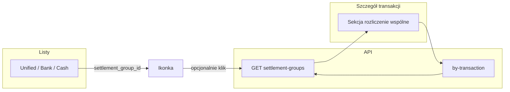

# Zestawy rozliczeniowe (łączenie wydatków i zwrotów) — design

**Date:** 2026-04-22  
**Status:** Draft (do akceptacji przed implementacją)  
**Suggested branch:** `feature/transaction-settlement-bundles`

---

## Problem

Użytkownik ma w aplikacji **osobne** zdarzenia pieniężne: wyciąg bankowy, gotówkę, paragony. Obowiązuje model **1:1** między wierszem wydatku a pozycją paragonu (`receipt_bank_links`, `receipt_cash_links`).

Rzeczywistość społeczno-rozliczeniowa jest bogatsza: **jeden wydatek** (np. restauracja) może być pokrywany **wieloma wpływami** (przelew od A, gotówka od B), a **jeden wpływ** może pokrywać **wiele wydatków** (paliwo + jedzenie — jeden przelew od kolegi). Użytkownik chce **jedną, spójną opowieść** widoczną z każdej powiązanej pozycji oraz **wskaznik w tabelach**, że transakcja wchodzi w szersze rozliczenie.

Dane referencyjne (prod): `bank_transactions` 2484 (Burrata, −450), 2481 (wpływ 150, Andrzej), `cash_transactions` 9 (150), paragon z linkiem do 2484 (`receipts_scans` 7828).

---

## Stosunek do istniejących linków

| Mechanizm | Znaczenie | Zmiana w tym feature |
|-----------|-----------|----------------------|
| `receipt_bank_links` / `receipt_cash_links` | „Ten rachunek = ta **konkretna** transakcja bankowa / gotówkowa” | **Bez zmiany semantyki.** Paragony w widoku „rozliczenia” pokazujemy **pośrednio** — z członków grupy, którzy mają taki link. |
| Zestaw rozliczeniowy (nowe) | „Te **kilkanaście wierszy** należą do **jednej** sytuacji (np. wspólna kolacja + zwroty)” | Nowa warstwa **nad** poszczególnymi tabelami. |

Paragon **nie** musi być osobnym „członkiem” tabeli grupy, jeśli jest już powiązany z wierszem banku/gotówki w grupie — wystarczy **wyprowadzenie w API/UI**. Opcję dodania niesparowanego skanu do grupy można odłożyć na później (poza v1, patrz Scope).

---

## Poza scope (v1)

- **Rozbicie kwot** w obrębie jednego wpływu (alokacja: ile z 300 zł idzie na stację, ile na pizzerię) — opcjonalna **przyszła** warstwa; v1: tylko **powiązania**, bez pól alokacji.
- **Automatyczne sugestie** kandydatów do grupy (heurystyki po dacie / kwocie) — później.
- **Osobny „członek” typu** `receipts_scans` / `receipt_transaction` w tabeli członków — v1: wyłącznie **bank** i **gotówka**; paragony z `JOIN` do istniejących tabel linków.
- Zmiana importu CSV ani deduplikacji `reference_number`.

---

## Słownik i nazewnictwo

### Kod / API (angielski)

- **`settlement_group`** — rekord nadrzędny (zbiór).
- Zasób REST: `settlement-groups` (kebab w URL jak w reszcie API).

### UI (polski) — rekomendowane

| Propozycja | Uwagi |
|------------|--------|
| **Rozliczenie wspólne** | Czytelne, nie myli się z przelewem. |
| **Powiązane operacje** | Neutralne, dobre gdy w zestawie są i wydatki, i wpływy. |
| *Powiązane transakcje* | Używane dotąd; OK, lecz słowo „transakcja” koliduje z potocznym sensą „jeden przelew” — dlatego w nagłówkach wolałbym **„rozliczenie wspólne”** lub **„u członków tego samego rozliczenia”**. |

Nazwa funkcji w menu / ustawieniach: **„Rozliczenia wspólne”** (lista zestawów) albo **„Łączenie transakcji”** (akcja).

### Czego unikać w copy

- Angielskie „**split**” jako nagłówek — w eye-budget „split” jest już użyty przy **kategoryzacji** banku (`category splits`); tu lepiej: **„u członków tego samego rozliczenia”**, **„pokrywa kilka wydatków”**.

---

## Wymagania funkcjonalne

1. Użytkownik może **utworzyć zestaw** i dodać do niego co najmniej **dwa** wiersze typu: `bank_transactions` albo `cash_transactions` (dowolna mieszanka).
2. **Każdy** taki wiersz może należeć do **co najwyżej jednego** zestawu.
3. Zestaw opcjonalnie ma **tytuł** i **notatkę** (obaj pola tekstowe, nullable).
4. Z widoku **każdej** transakcji należącej do zestawu: sekcja z **listą pozostałych członków** + **zagregowane paragony** wynikające z istniejących `receipt_*_links` członków.
5. Na **liście** transakcji (zunifikowanej / bank / gotówka — tam gdzie dziś pokazywany jest m.in. `has_receipt`) widoczna **ikonka** (lub odpowiednik `Badge`), że wiersz jest w zestawie.
6. Użytkownik może **usunąć** członka z zestawu, **edytować** metadane zestawu, **rozwiazać** cały zestaw (usuwa powiązania, nie kasuje transakcji).
7. Gdy w zestawie zostaje **mniej niż dwa** członki, system **likwiduje** cały zestaw (spójność: nie przechowujemy „grupy jednoelementowej”).

---

## Model danych

### Nowe tabele

```sql
-- Zestaw rozliczeniowy
CREATE TABLE settlement_groups (
    id          SERIAL PRIMARY KEY,
    title       TEXT,
    note        TEXT,
    created_at  TIMESTAMPTZ NOT NULL DEFAULT NOW(),
    updated_at  TIMESTAMPTZ
);

-- Członek: dokładnie jeden z bank albo gotówka (XOR)
CREATE TABLE settlement_group_members (
    id                    SERIAL PRIMARY KEY,
    group_id              INTEGER NOT NULL
                              REFERENCES settlement_groups(id) ON DELETE CASCADE,
    bank_transaction_id   INTEGER
                              REFERENCES bank_transactions(id) ON DELETE CASCADE,
    cash_transaction_id     INTEGER
                              REFERENCES cash_transactions(id) ON DELETE CASCADE,
    created_at            TIMESTAMPTZ NOT NULL DEFAULT NOW(),
    CHECK (
        (bank_transaction_id IS NOT NULL AND cash_transaction_id IS NULL)
        OR
        (bank_transaction_id IS NULL AND cash_transaction_id IS NOT NULL)
    )
);

-- Każda transakcja bank / gotówka w co najwyżej jednym zestawie
CREATE UNIQUE INDEX uq_sgm_bank ON settlement_group_members (bank_transaction_id)
    WHERE bank_transaction_id IS NOT NULL;
CREATE UNIQUE INDEX uq_sgm_cash ON settlement_group_members (cash_transaction_id)
    WHERE cash_transaction_id IS NOT NULL;

CREATE INDEX idx_sgm_group ON settlement_group_members (group_id);
```

### Zachowanie przy usuwaniu transakcji

- `ON DELETE CASCADE` z członka: przy skasowaniu `bank_transactions` wiersz członka znika; **po tym** logika (trigger lub repozytorium) zmniejsza liczbę członków; jeśli &lt; 2 — **usuwa `settlement_groups` dla tego `group_id`** (i pozostali członkowie też znikają przez CASCADE z grupy — uwaga: kolejność musi być bezpieczna).  
- Implementacyjnie bezpieczniej: **trigger** `AFTER DELETE ON settlement_group_members` aktualizujący/ sprawdzający `member_count` i usuwający pusty lub 1-elementowy zestaw **albo** pełna obsługa w warstwie repo w jednej transakcji DB (preferowane dla testowalności: jeden `DELETE ...` z `RETURNING` i follow-up).

**Rekomendacja:** prosty trigger „jeśli po DELETE liczba członków grupy &lt; 2, DELETE FROM settlement_groups WHERE id = ...” w jednej transakcji zapewnia spójność także przy ręcznych `DELETE` w dev.

### Inwarianty (aplikacja + DB)

- Tworzenie / dodawanie: **odrzucenie** (409), jeśli wybrany `bank_transaction_id` lub `cash_transaction_id` już występuje w `settlement_group_members`.
- **Minimalna liczba członków 2** przy `INSERT` nowej grupy (jedna transakcja: insert `settlement_groups` + ≥ 2 wiersze członków) **albo** dodanie do istniejącej grupy tak długo, jak po operacji |członkowie| ≥ 2.

---

## API (szkic kontraktu)

Wszystkie odpowiedzi JSON; błędy zgodne z `backend/AGENTS.md` / istniejącym `ApiError` (4xx z ciałem błędu).

| Metoda | Ścieżka | Opis |
|--------|---------|------|
| `POST` | `/settlement-groups` | Ciało: `title?`, `note?`, `members: [{ "source_type": "bank" \| "cash", "id": int }, ...]`, `len(members) >= 2`, unikalne pary, brak konfliktu z istniejącymi członkostwami. Zwraca `SettlementGroupDetail`. |
| `GET` | `/settlement-groups/{id}` | Pełny zestaw: członkowie + zagregowane paragony (patrz niżej). |
| `GET` | `/settlement-groups/by-transaction?source_type=bank&transaction_id=…` (lub `cash`) | 404 jeśli brak; inaczej jak `GET /settlement-groups/{id}`. |
| `PATCH` | `/settlement-groups/{id}` | Tylko `title`, `note`. |
| `POST` | `/settlement-groups/{id}/members` | Pojedynczy członek; 409 gdy transakcja już w innej grupie. Po dodaniu przeliczyć spójność. |
| `DELETE` | `/settlement-groups/{id}/members` | Ciało lub query: `source_type` + `transaction_id` — wyciąga członka; jeśli zostaje &lt; 2, usuwa całą grupę. |
| `DELETE` | `/settlement-groups/{id}` | Usuwa grupę (CASCADE na członków); transakcje zostają. |

**`SettlementGroupDetail` (Pydantic, szkic):**

- `id`, `title`, `note`, `created_at`, `updated_at`
- `members: list[SettlementMember]` — każdy z: `source_type`, `id`, dane do podglądu (data, kwota, opis, `vendor_name` — jak w listach) — możliwe użycie `UnifiedTransaction`-like slice lub odczyt z repozytoriów bank/cash.
- `linked_receipts: list[LinkedReceiptSummary]` — złączenie: dla każdego `bank` z `receipt_bank_links` i każdego `cash` z `receipt_cash_links` (deduplikacja po `receipts_scans.id` / `receipt_transaction_id`).

Listy `GET` transakcji (unified, bank, cash) otrzymują **dodatkowe pole** schematycznie:

- `settlement_group_id: int | null` **lub** `in_settlement_group: bool` — wystarczy `bool` w listach, jeśli chcemy ograniczyć rozmiar; `id` potrzebny, jeśli z ikony mamy iść w „szczegóły grupy” jednym klikem **bez** dodatkowego GET po transakcji. **Rekomendacja:** `settlement_group_id: int | null` w modelach listowych (jeden `LEFT JOIN` / podzapytanie z `settlement_group_members`).

---

## Repozytoria

- `SettlementGroupsRepository` (nowy): CRUD + `get_by_id`, `get_id_for_member(source_type, id)`, `add_members`, `remove_member`, `delete_group`.
- Rozszerzenie zapytań w `UnifiedTransactionsRepository` oraz listach `BankTransactions` / `CashTransactions` o **jedną** kolumnę `settlement_group_id` (LEFT JOIN na `settlement_group_members`).

---

## UI

### Wymiary

- **Desktop i mobile** — sekcja szczegółu musi być czytelna w wąskiej kolumnie (scroll poziomy w tabeli członków tylko w ostateczności; preferowana karta pionowa).

### Listy (zunifikowana / bank / gotówka)

- Kolumna lub komórka z **ikoną** (np. `Link2` / `Users` / `Split` z lucide — do uzgodnienia z design system) + `aria-label` po polsku, np. „W rozliczeniu wspólnym”.
- Tooltip: „Jest w zestawie rozliczeniowym” (krótko). Opcjonalnie klik przechodzi do `GET` grupy (panel boczny / podstrona).

### Widok transakcji (detail)

- Sekcja **„Rozliczenie wspólne”** (lub spójny z tabelą tytuł):
  - jeśli `settlement_group_id` puste — przycisk **„Dodaj do rozliczenia”** otwierający:
    - tryb A: wyszukiwarka innych transakcji (data/kwota) + multiselect **albo**
    - tryb B (v1, prostsze): użytkownik **wpisuje ID** / wybiera z ostatnich (minimalny MVP) — **rekomendacja v1:** modal **„Utwórz nowe rozliczenie”** z wyborem co najmniej **jednej** innej transakcji (obecna jest już znana) — dokładna iteracja UI w planie implementacji; spec domyśla, że **musi** dać się połączyć obecną stronę z co najmniej jednym innym wierszem.
- jeśli jest w grupie: lista innych członków (linki do ich detaili) + skrót paragonów (miniaturka / data / kwota) zgodnie z `linked_receipts`.
- **Edycja meta:** tytuł, notatka (inline lub podstrona grupy).
- **Rozłącz** — usunięcie z grupy (z potwierdzeniem, jeśli to ostatni partner i grupa zniknie).

### Widok opcjonalny: `/settlement-groups` (lista wszystkich zestawów)

- Poza obowiązkowym MVP: **nice-to-have**; wystarczy nawigacja z ikony w liście do `GET` jednej grupy.

---

## Testy

- Testy **repozytorium** (transakcja DB lub integracja z testową PG): unikalność, kasowanie grupy gdy &lt; 2 członków, 409 przy duplikacie członka.
- Testy **API** (istniejący wzorzec `app` tests): happy path `POST` → `GET` → `DELETE` member → grupa usunięta.
- **Zero** regresji: istniejące `receipt_*_links` — smoke po zmianach w SELECT list.

---

## Bezpieczeństwo i wielodostęp (jeśli kiedyś)

Dziś prawdopodobnie single-user. Gdy pojawią się org / role: ograniczenie `settlement_groups` do kontekstu użytkownika (jeśli tabela będzie miała `user_id`); **poza scope** v1.

---

## Migracja

- Jeden plik Yoyo w `backend/migrations/`: `20260422_01_settlement_groups.sql` (lub następny wolny numer) z tabelami i indeksami.
- Brak danych startowych; brak backfillu.

---

## Mermaid — przepłyg danych w UI



---

## Checklist przed implementacją

- [ ] Akceptacja nazwy w UI: „Rozliczenie wspólne” vs „Powiązane operacje”.
- [ ] Czy tryb **v1** tworzy grupę tylko z ekranu transakcji, czy potrzebna jest osobna strona listy grup — decyzja produktowa.
- [ ] Potwierdzenie: trigger vs repository-only dla `member_count < 2`.

---

## Self-review (2026-04-22)

- **Placeholdery:** brak TBD w modelu; szczegół modala (tryb A/B) pozostawiony jako decyzja implementacyjna z minimum „powiąż obecną z ≥1 inną”.
- **Spójność:** `receipt_*_links` nienaruszone; nowe tabele ortogonalne.
- **Scope:** ograniczony; alokacje i skany jako members poza v1.
- **Jednoznaczność:** unikalność bank/cash per grupa, rozwiązanie grupy przy &lt; 2 członkach — jawnie opisane.
